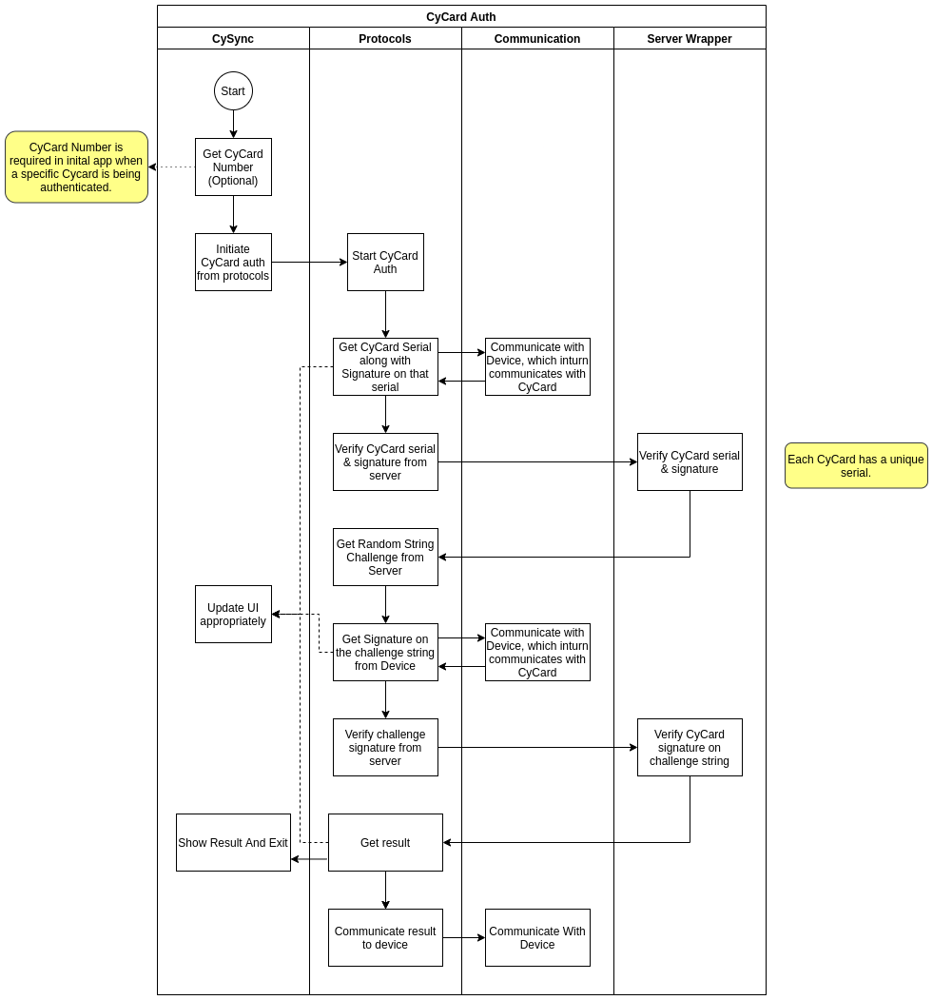
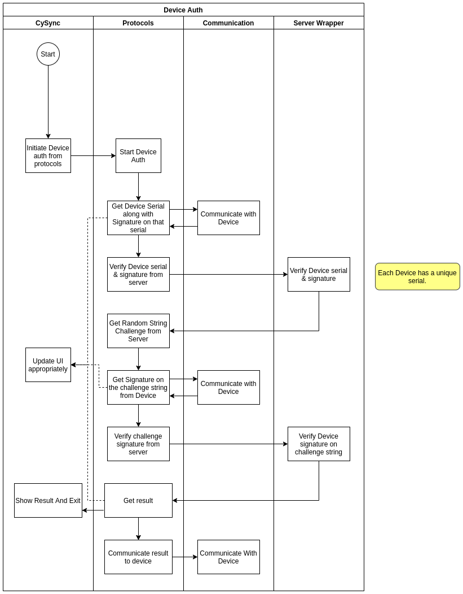
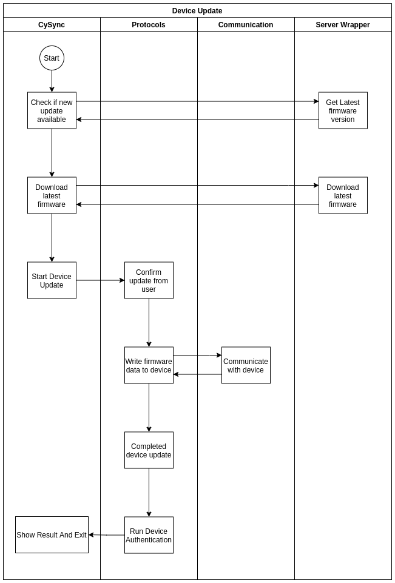
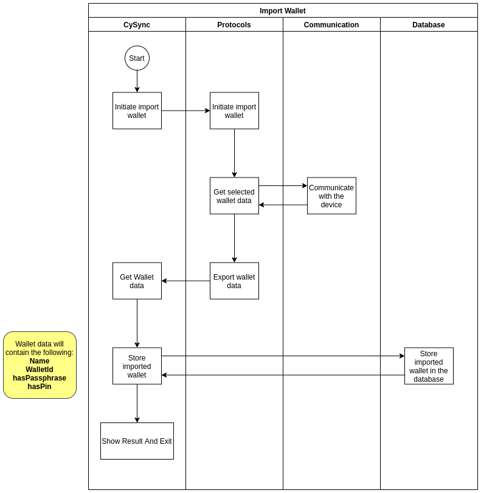
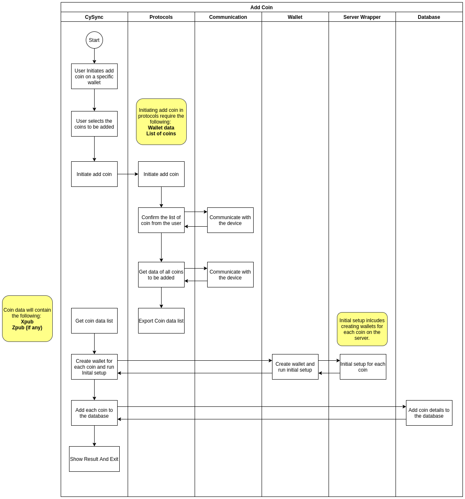
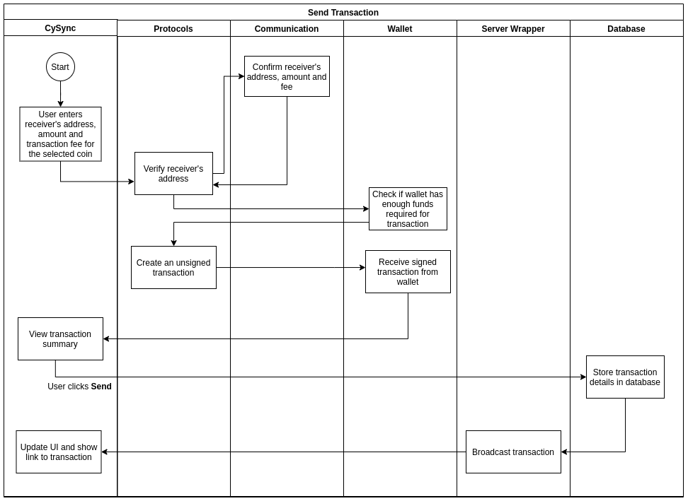
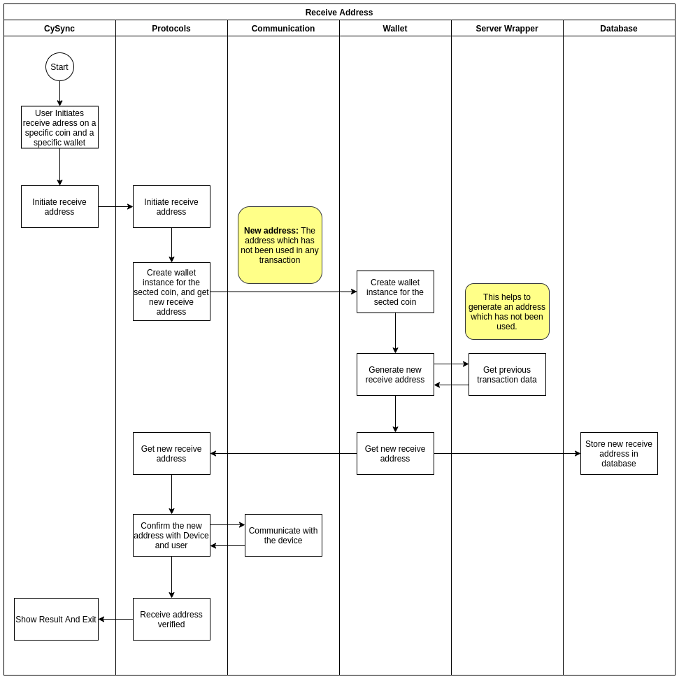

# Application Flows


## Initial Flow
On the first launch, CySync asks you to setup a new device, followed by setting a password for the app.
All X1 Cards are verified (one at a time) by tapping them on the device.
Once done, the app proceeds to update the firmware on the device, after which the app is successfully synced with the card.
The following flow takes place in the desktop app -

- **Card Authentication**
    - The `protocols` package starts with the authetication of X1 Cards. The flow starts from the hook in `useCardAuth.ts`.
    - It fetches the X1 Card serial along with its signature. This data is communicated to the device by the `communications` package.
    - The serial and signature are verified from the server using the `server-wrapper` package. Once verified, the server returns a random string challenge back to the protocols package.
    > *Each X1 Card has a unique serial.*
    - The challenge signature is verified and the signature is sent to server for verification.
    - On successful verification, the application displays a success message. `protocols` communicates the response to the device using the `communication` package.
    <p align="center"></p>

- **Device Authentication**
    - The `DeviceAuthenticator.run` method inside the `protocols` package authenticates the device. It verifies the device serial signature and challenge signature. The hook `useCheckDeviceAuth.ts` uses this method and logs event data for events such as `serial`, `firmwareVersion`, and `lastAuth`. Any errors in connection and authentication are handled by the `useCheckDeviceAuth` hook. See `useCheckDeviceAuth.ts` for implementation.
    - The hook in `useDeviceAuth.ts` also uses the `DeviceAuthenticator.run` method from the `protocols` package. Once the device is verified, it emits the event `confirmed` which updates the confirmation and verification state in the hook.
    <p align="center"></p>

- **Device Upgrade**
    - Use the deviceAuth hook to first authenticate the device.
    - `firmwareServer` (server-wrapper package) gets the latest firmware available and notifies the app that update is available.
    - Inside `deviceUpgrade.ts`, the `useDeviceUpgrade` hook uses a `OpenBootloaderUpdate` instance (protocols package) which emits an `updateConfirmed` event to mark the confirmation of the upgrade.
    <p align="center"></p>


## Importing a wallet
- The `handleAddWallet` hook inside `app/store/hooks/flows/useAddWallet.ts` receives events from the device and handles the flow.
- This uses the `protocols` package to interact with the device.
- It listens to events emitted from the device via the protocols package, located inside `protocols/src/flows/addWallet/index.ts`.
- After a wallet is generated on the device, the `walletDetails` event is emitted, with payload including *walletId, name, passwordSet, passphraseSet*.
- These details are then inserted inside the database represented by the `WalletDB` class.
- If a *walletId* already exists, it is updated by the `updateName()` inside `useAddWallet.ts`.
<p align="center"></p>

## Adding coins to the wallet
When adding coins to the wallet, the following flow takes place -
- Once a coin is selected from the GUI, the hook defined in `useAddCoin.ts` handles the events related to adding a coin.
- It uses the protocols package to communicate with the device.
- Coins selected from the GUI are an array of objects with keys *xpub, name* and *status*.
- These are added in sequence (one at a time) using the `setUpCoinWallets` method in `useAddCoin` hook.
- `executeNextInQueue` runs for the next coin in the array to start adding it to the wallet.
- `handleCoinAdd` sets up listener for events emitted from the device, such as "cardError", "locked", "coinsConfirmed", "xpubList" etc. See `useAddCoin.ts` for all listeners.
- The xpub is then inserted into the database represented by `xpubDb`.
<p align="center"></p>


## Sending coins
The general flow -
1. Get receiver's address and amount as input
2. Set transaction fee to adjust transaction priority
3. Create transaction and await confirmation from device
4. Once confirmed, broadcast the signed transaction onto the network.

The following things execute the flow -
- The `useSendTransaction` contains utilities related to sending a transaction.
- `handleSendTransaction()` inside the hook sets up listeners to respond to device response. An instance of `TransactionSender` (defined in the protocols package) listens to events such as "cardError", "locked", "coinsConfirmed", and "txnTooLarge".
- The protocols package then fetches the fee from the network, performs all the checks on the transaction .
- Once created, the transaction is verified in the package and the `signatureVerify` event is emitted from the protocols package.
- The `onTxnBroadcast()` method then appends all inputs and outputs to the transaction (type `InputOutput`), and broadcasts the transaction using the `server-wrapper` package..
- If successful, the transaction details are stored in the database represented by the `TransactionDB` class.
<p align="center"></p>


## Receiving coins
1. Choose a coin (Bitcoin testnet, for example)
2. Fetch a new address from the blockchain
3. Await confirmation from device
4. Display the new address to receive amount on.

> _Address can receive coins even if not verified by the device._

The following things execute the flow -
- For the selected coin type, the `getReceiveAddress()` method in `Receive.tsx` generates a new receive address using the xpub.
- In `useReceiveTransaction.ts` hook, an instance of `TransactionReceiver` from the protocols package listens to events emitted by the protocols package, such as "cardError", "noWalletFound", "noXpub", "coinsConfirmed" etc.
- When a new address is received, `onNewReceiveAddr()` stores it in the database represented by `ReceiveAddressDB`.
- `onNewReceiveAddr()` also updates the component state of `coinVerified` to show "Address Verified" on the GUI.
- Inside protocols, once the cards are tapped and verified, the `coinsConfirmed` event is emitted, which is caught by `handleReceiveTransaction()` inside the hook.
<p align="center"></p>


# Build Types

### Build types for different users

| Build Type  | Target users |
| ------------- | ------------- |
| Beta | For the existing users who have non provisioned devices |
| Test Beta | Test Version for Beta build |
|  Beta Bridge | (This will be on the website) For new users who have provisioned devices |
| Test | Test Version for Beta Bridge build |
|  Test STM | Test Version for Beta build of STM device (provisioned) |
| Test STM Beta | Test Version for Beta build of STM device (non provisioned) |
|  Beta STM | For the users who have provisioned STM devices |

### Changes for test builds
1. The device update will not happen via Cypherock server, it will update with local  app_dfu_package.zip (in case of STM build app_dfu_package.bin) file. So, you need to add this file manually.
For this you first need to find out the location where the application data is stored:
    - Open the CySync App, right click anywhere and select "Inspect Element".
    - Select the "Console" tab from the topbar.
    - Paste the following code at the bottom.
```javascript
const { remote } = require('electron');
remote.getGlobal('userDataPath');
 ```
You will get a path to where the application data is stored.

After you have this path, you need to add a file named "app_dfu_package.zip" (in case of STM build app_dfu_package.bin) containing the firmware version which you want on your device.

2. Going to the device update from the settings will always show “new version available”.
3. When on the below screen, we can skip the initial flow altogether and go to the main desktop app by a Keyboard shortcut “Ctrl + T”
4. When on the below screen, we can skip all the 3 steps by the keyboard shortcut “Ctrl + T”
5. When on the same screen as above, we can skip the card auth after it has failed by the keyboard shortcut “Ctrl + S”.
> **Note**: For this to work, make sure your device is on the main menu after all the cards have failed.
6. It does not fetch latest balance and transaction on application startup.
7. It does not connect to socket io for real time transaction & balance information.


------

# Packages

### Communication Package
The communication padckage  handles all low level protocols such as checking for errors in transmission (CRC) and Acknowledgement. Read more about the package [here](https://github.com/Cypherock/cysync-module-communication).


### Database package
The database package acts as a wrapper for all database and server calls in the application. Read more about the database package [here](https://github.com/Cypherock/cysync-module-database).


### Protocols package
The protocols package contains the communciation flow with the hardware wallet - such as Add Wallet, Add Coin, Send Transaction, Receive Transaction, Card Authentication, and Device Upgrade. Read more about the package [here](https://github.com/Cypherock/cysync-module-protocols).


### Server Wrapper
The server wrapper interacts with the Cypherock Server. All other modules communicate with the server through this module.
Read more about the package [here](https://github.com/Cypherock/cysync-module-server).


### Wallet package
This module contains all the code for all blockchain-related functions, such as fetching and creating unsigned transactions, and getting a new receive address. Read more about the wallets package [here](https://github.com/Cypherock/cysync-module-wallet).
